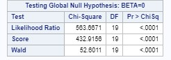
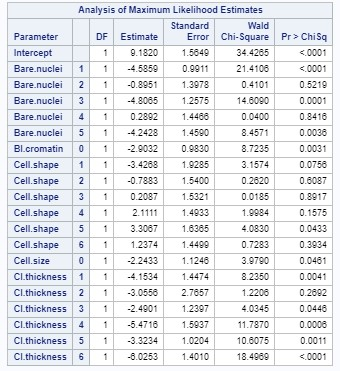
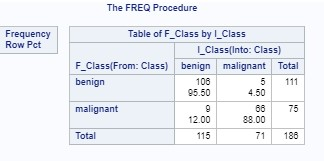
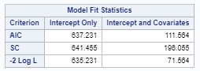
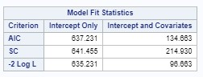
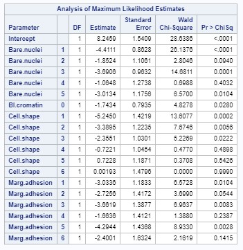
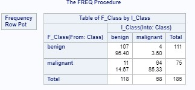
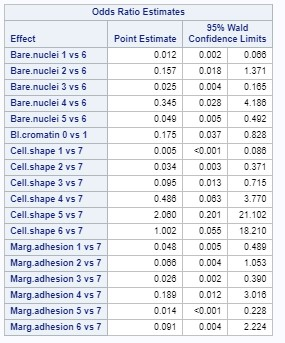

```{r code, echo = FALSE, eval = TRUE, include=FALSE, fig.width= 20, fig.height= 30, warning= FALSE, message=FALSE}
#Later going to add this in Appendix too and will hide this bit of code.  Just listing it first so I can call objects in RMarkdown. 

#Turn off scientific notation. It is annoying. 
options(scipen=999)


# install the required packages if needed
list.of.packages <- c("sqldf", "glmnet", "gfortran", "rgl", "CVST", "igraph", "recipes", "ggplot2", "caret", "forcats", "olsrr", "tidyr", "corrplot", "parallel", "doParallel", "mlbench" ,"pheatmap","RColorBrewer","rpart.plot", "gridExtra")
new.packages <- list.of.packages[!(list.of.packages %in% installed.packages()[,"Package"])]
if(length(new.packages)) install.packages(new.packages, repos="http://cran.r-project.org")

library(sqldf) # Used for manipulating the data frames using SQL
library(glmnet) # Used for...
library(caret) # Used for...
library(forcats) # Used for...
library(olsrr) # Used for creating the foward
library(MASS) # Used for backward, and stepwise models
library(tidyr) #Used for creating some of the plots
library(ggplot2) #Used for creating some of the plots
library(corrplot) #Used to create the correlation matrix
library(parallel) #Using to assign more cores and allow parallel processing
library(doParallel) #Using to assign more cores and allow parallel processing
library(mlbench) #Contains the data set
library(pheatmap)
library(RColorBrewer)
library(gtable)
library(grid)
library(gridExtra)
library(rpart.plot)

#Load in the data
data("BreastCancer")

class(BreastCancer$Cl.thickness)
class(BreastCancer$Cell.size)
class(BreastCancer$Cell.shape)
class(BreastCancer$Marg.adhesion)
class(BreastCancer$Epith.c.size)
class(BreastCancer$Bare.nuclei)
class(BreastCancer$Bl.cromatin)
class(BreastCancer$Normal.nucleoli)
class(BreastCancer$Mitoses)

BreastCancer$Cl.thickness <- as.numeric(BreastCancer$Cl.thickness)
BreastCancer$Cell.size <- as.numeric(BreastCancer$Cell.size)
BreastCancer$Cell.shape <- as.numeric(BreastCancer$Cell.shape)
BreastCancer$Marg.adhesion<- as.numeric(BreastCancer$Marg.adhesion)
BreastCancer$Epith.c.size<- as.numeric(BreastCancer$Epith.c.size)
BreastCancer$Bare.nuclei<- as.numeric(BreastCancer$Bare.nuclei)
BreastCancer$Bl.cromatin<- as.numeric(BreastCancer$Bl.cromatin)
BreastCancer$Normal.nucleoli<- as.numeric(BreastCancer$Normal.nucleoli)
BreastCancer$Mitoses<- as.numeric(BreastCancer$Mitoses)


#Exploratory Analysis


p1 <- ggplot(BreastCancer, aes(Cl.thickness, fill=Class)) + geom_histogram(stat="count") + scale_fill_manual(values=c("dodgerblue", "red3")) + theme_dark() + theme(legend.position = "none") + labs(x="Cell thickness")
p2 <- ggplot(BreastCancer, aes(Cell.size, fill=Class)) + geom_histogram(stat="count") + scale_fill_manual(values=c("dodgerblue", "red3")) + theme_dark() + theme(legend.position = "none") + labs(x="Cell size")
p3 <- ggplot(BreastCancer, aes(Cell.shape, fill=Class)) + geom_histogram(stat="count") + scale_fill_manual(values=c("dodgerblue", "red3")) + theme_dark() + theme(legend.position = "none") + labs(x="Cell shape")
p4 <- ggplot(BreastCancer, aes(Marg.adhesion, fill=Class)) + geom_histogram(stat="count") + scale_fill_manual(values=c("dodgerblue", "red3")) + theme_dark() + theme(legend.position = "none") + labs(x="Marginal adhesion")
p5 <- ggplot(BreastCancer, aes(Epith.c.size, fill=Class)) + geom_histogram(stat="count") + scale_fill_manual(values=c("dodgerblue", "red3")) + theme_dark() + theme(legend.position = "none") + labs(x="Single epithelial cell size")
p6 <- ggplot(BreastCancer, aes(Bare.nuclei, fill=Class)) + geom_histogram(stat="count") + scale_fill_manual(values=c("dodgerblue", "red3")) + theme_dark() + theme(legend.position = "none") + labs(x="Bare nuclei")
p7 <- ggplot(BreastCancer, aes(Bl.cromatin, fill=Class)) + geom_histogram(stat="count") + scale_fill_manual(values=c("dodgerblue", "red3")) + theme_dark() + theme(legend.position = "none") + labs(x="Bland cromatin")
p8 <- ggplot(BreastCancer, aes(Normal.nucleoli, fill=Class)) + geom_histogram(stat="count") + scale_fill_manual(values=c("dodgerblue", "red3")) + theme_dark() + theme(legend.position = "none") + labs(x="Normal nuclei")
p9 <- ggplot(BreastCancer, aes(Mitoses, fill=Class)) + geom_histogram(stat="count") + scale_fill_manual(values=c("dodgerblue", "red3")) + theme_dark() + theme(legend.position = "none")
p10 <- ggplot(BreastCancer, aes(Class, fill=Class)) + geom_bar() + scale_fill_manual(values=c("dodgerblue", "red3")) + theme_dark() + theme(legend.position="right") + coord_flip() + labs(title="Overall counts of malignant and benign samples")
lay <- rbind(c(1,2,3), c(1,2,3), c(4,5,6), c(4,5,6), c(7,8,9), c(7,8,9), c(10,10,10), c(10,10,10))

grid.arrange(p1, p2, p3, p4, p5, p6, p7, p8, p9, p10)

BreastCancer2 <- BreastCancer
BreastCancer2$Cl.thickness <- as.character(BreastCancer2$Cl.thickness)
BreastCancer2$Cell.size <- as.character(BreastCancer2$Cell.size)
BreastCancer2$Cell.shape <- as.character(BreastCancer2$Cell.shape)
BreastCancer2$Marg.adhesion<- as.character(BreastCancer2$Marg.adhesion)
BreastCancer2$Epith.c.size<- as.character(BreastCancer2$Epith.c.size)
BreastCancer2$Bare.nuclei<- as.character(BreastCancer2$Bare.nuclei)
BreastCancer2$Bl.cromatin<- as.character(BreastCancer2$Bl.cromatin)
BreastCancer2$Normal.nucleoli<- as.character(BreastCancer2$Normal.nucleoli)
BreastCancer2$Mitoses<- as.character(BreastCancer2$Mitoses)
#cutoff on Cl.thickness was made to be greater than or equal to 7
BreastCancer2$Cl.thickness[BreastCancer2$Cl.thickness == "8"] <- "7"
BreastCancer2$Cl.thickness[BreastCancer2$Cl.thickness == "9"] <- "7"
BreastCancer2$Cl.thickness[BreastCancer2$Cl.thickness == "10"] <- "7"
#cutoff on Cell.size 0 for levels 1 to 5, and 1 for levels 6 to 10
BreastCancer2$Cell.size[BreastCancer2$Cell.size == "1"] <- "0"
BreastCancer2$Cell.size[BreastCancer2$Cell.size == "2"] <- "0"
BreastCancer2$Cell.size[BreastCancer2$Cell.size == "3"] <- "0"
BreastCancer2$Cell.size[BreastCancer2$Cell.size == "4"] <- "0"
BreastCancer2$Cell.size[BreastCancer2$Cell.size == "5"] <- "0"
BreastCancer2$Cell.size[BreastCancer2$Cell.size == "6"] <- "1"
BreastCancer2$Cell.size[BreastCancer2$Cell.size == "7"] <- "1"
BreastCancer2$Cell.size[BreastCancer2$Cell.size == "8"] <- "1"
BreastCancer2$Cell.size[BreastCancer2$Cell.size == "9"] <- "1"
BreastCancer2$Cell.size[BreastCancer2$Cell.size == "10"] <- "1"
#cutoff on Cell.shape is greater than or euqal to 7 are grouped together as 7
BreastCancer2$Cell.shape[BreastCancer2$Cell.shape == "8"] <- "7"
BreastCancer2$Cell.shape[BreastCancer2$Cell.shape == "9"] <- "7"
BreastCancer2$Cell.shape[BreastCancer2$Cell.shape == "10"] <- "7"
#cutoff for Marg.adhesion is greater than or equal to 7 are groupted together as 7
BreastCancer2$Marg.adhesion[BreastCancer2$Marg.adhesion == "8"] <- "7"
BreastCancer2$Marg.adhesion[BreastCancer2$Marg.adhesion == "9"] <- "7"
BreastCancer2$Marg.adhesion[BreastCancer2$Marg.adhesion == "10"] <- "7"
#cutoff for Epith.c.size is split as 0 for levels 1 to 5, and 1 for levels 6 to 10
BreastCancer2$Epith.c.size[BreastCancer2$Epith.c.size == "1"] <- "0"
BreastCancer2$Epith.c.size[BreastCancer2$Epith.c.size == "2"] <- "0"
BreastCancer2$Epith.c.size[BreastCancer2$Epith.c.size == "3"] <- "0"
BreastCancer2$Epith.c.size[BreastCancer2$Epith.c.size == "4"] <- "0"
BreastCancer2$Epith.c.size[BreastCancer2$Epith.c.size == "5"] <- "0"
BreastCancer2$Epith.c.size[BreastCancer2$Epith.c.size == "6"] <- "1"
BreastCancer2$Epith.c.size[BreastCancer2$Epith.c.size == "7"] <- "1"
BreastCancer2$Epith.c.size[BreastCancer2$Epith.c.size == "8"] <- "1"
BreastCancer2$Epith.c.size[BreastCancer2$Epith.c.size == "9"] <- "1"
BreastCancer2$Epith.c.size[BreastCancer2$Epith.c.size == "10"] <- "1"
#cutoff for Bare.nuclei is greater than or equal to 6 are grouped together as 6
BreastCancer2$Bare.nuclei[BreastCancer2$Bare.nuclei == "7"] <- "6"
BreastCancer2$Bare.nuclei[BreastCancer2$Bare.nuclei == "8"] <- "6"
BreastCancer2$Bare.nuclei[BreastCancer2$Bare.nuclei == "9"] <- "6"
BreastCancer2$Bare.nuclei[BreastCancer2$Bare.nuclei == "10"] <- "6"
#cutoff for Bl.cromatin is split as 0 for levels 1 to 5, 1 for levels 6 to 10
BreastCancer2$Bl.cromatin[BreastCancer2$Bl.cromatin == "1"] <- "0"
BreastCancer2$Bl.cromatin[BreastCancer2$Bl.cromatin == "2"] <- "0"
BreastCancer2$Bl.cromatin[BreastCancer2$Bl.cromatin == "3"] <- "0"
BreastCancer2$Bl.cromatin[BreastCancer2$Bl.cromatin == "4"] <- "0"
BreastCancer2$Bl.cromatin[BreastCancer2$Bl.cromatin == "5"] <- "0"
BreastCancer2$Bl.cromatin[BreastCancer2$Bl.cromatin == "6"] <- "1"
BreastCancer2$Bl.cromatin[BreastCancer2$Bl.cromatin == "7"] <- "1"
BreastCancer2$Bl.cromatin[BreastCancer2$Bl.cromatin == "8"] <- "1"
BreastCancer2$Bl.cromatin[BreastCancer2$Bl.cromatin == "9"] <- "1"
BreastCancer2$Bl.cromatin[BreastCancer2$Bl.cromatin == "10"] <- "1"
#cutoff for Normal.nucleoli is greater than or equal to 7 are grouped together as 7
BreastCancer2$Normal.nucleoli[BreastCancer2$Normal.nucleoli == "8"] <- "7"
BreastCancer2$Normal.nucleoli[BreastCancer2$Normal.nucleoli == "9"] <- "7"
BreastCancer2$Normal.nucleoli[BreastCancer2$Normal.nucleoli == "10"] <- "7"
#cutoff for Mitoses is split as 0 for levels 1 to 5, and 1 for levels 6 to 10
BreastCancer2$Mitoses[BreastCancer2$Mitoses == "1"] <- "0"
BreastCancer2$Mitoses[BreastCancer2$Mitoses == "2"] <- "0"
BreastCancer2$Mitoses[BreastCancer2$Mitoses == "3"] <- "0"
BreastCancer2$Mitoses[BreastCancer2$Mitoses == "4"] <- "0"
BreastCancer2$Mitoses[BreastCancer2$Mitoses == "5"] <- "0"
BreastCancer2$Mitoses[BreastCancer2$Mitoses == "6"] <- "1"
BreastCancer2$Mitoses[BreastCancer2$Mitoses == "7"] <- "1"
BreastCancer2$Mitoses[BreastCancer2$Mitoses == "8"] <- "1"
BreastCancer2$Mitoses[BreastCancer2$Mitoses == "9"] <- "1"
BreastCancer2$Mitoses[BreastCancer2$Mitoses == "10"] <- "1"
BreastCancer2$Cl.thickness <- as.numeric(BreastCancer2$Cl.thickness)
BreastCancer2$Cell.size <- as.numeric(BreastCancer2$Cell.size)
BreastCancer2$Cell.shape <- as.numeric(BreastCancer2$Cell.shape)
BreastCancer2$Marg.adhesion<- as.numeric(BreastCancer2$Marg.adhesion)
BreastCancer2$Epith.c.size<- as.numeric(BreastCancer2$Epith.c.size)
BreastCancer2$Bare.nuclei<- as.numeric(BreastCancer2$Bare.nuclei)
BreastCancer2$Bl.cromatin<- as.numeric(BreastCancer2$Bl.cromatin)
BreastCancer2$Normal.nucleoli<- as.numeric(BreastCancer2$Normal.nucleoli)
BreastCancer2$Mitoses<- as.numeric(BreastCancer2$Mitoses)

p11 <- ggplot(BreastCancer2, aes(Cl.thickness, fill=Class)) + geom_histogram(stat="count") + scale_fill_manual(values=c("dodgerblue", "red3")) + theme_dark() + theme(legend.position = "none") + labs(x="Cell thickness")
p12 <- ggplot(BreastCancer2, aes(Cell.size, fill=Class)) + geom_histogram(stat="count") + scale_fill_manual(values=c("dodgerblue", "red3")) + theme_dark() + theme(legend.position = "none") + labs(x="Cell size") + scale_x_continuous(breaks=c(0, 1))
p13 <- ggplot(BreastCancer2, aes(Cell.shape, fill=Class)) + geom_histogram(stat="count") + scale_fill_manual(values=c("dodgerblue", "red3")) + theme_dark() + theme(legend.position = "none") + labs(x="Cell shape")
p14 <- ggplot(BreastCancer2, aes(Marg.adhesion, fill=Class)) + geom_histogram(stat="count") + scale_fill_manual(values=c("dodgerblue", "red3")) + theme_dark() + theme(legend.position = "none") + labs(x="Marginal adhesion")
p15 <- ggplot(BreastCancer2, aes(Epith.c.size, fill=Class)) + geom_histogram(stat="count") + scale_fill_manual(values=c("dodgerblue", "red3")) + theme_dark() + theme(legend.position = "none") + labs(x="Single epithelial cell size") + scale_x_continuous(breaks=c(0, 1))
p16 <- ggplot(BreastCancer2, aes(Bare.nuclei, fill=Class)) + geom_histogram(stat="count") + scale_fill_manual(values=c("dodgerblue", "red3")) + theme_dark() + theme(legend.position = "none") + labs(x="Bare nuclei")
p17 <- ggplot(BreastCancer2, aes(Bl.cromatin, fill=Class)) + geom_histogram(stat="count") + scale_fill_manual(values=c("dodgerblue", "red3")) + theme_dark() + theme(legend.position = "none") + labs(x="Bland cromatin") + scale_x_continuous(breaks=c(0, 1))
p18 <- ggplot(BreastCancer2, aes(Normal.nucleoli, fill=Class)) + geom_histogram(stat="count") + scale_fill_manual(values=c("dodgerblue", "red3")) + theme_dark() + theme(legend.position = "none") + labs(x="Normal nuclei")
p19 <- ggplot(BreastCancer2, aes(Mitoses, fill=Class)) + geom_histogram(stat="count") + scale_fill_manual(values=c("dodgerblue", "red3")) + theme_dark() + theme(legend.position = "none") + scale_x_continuous(breaks=c(0, 1))
lay2 <- rbind(c(1,2,3), c(1,2,3), c(4,5,6), c(4,5,6), c(7,8,9), c(7,8,9))
grid.arrange(p11, p12, p13, p14, p15, p16, p17, p18, p19, top="Distribution of cancer after categorical factor compression", layout_matrix=lay2)


# Set seed for reproducibility
set.seed(0)

#This shows us what is null
sapply(BreastCancer, function(x) sum(is.na(x)))

BreastCancer$Bare.nuclei <- as.integer(BreastCancer$Bare.nuclei)

# use mean imputation to handle missing Bare.nuclei data.  Median was 1

mean(as.integer(BreastCancer$Bare.nuclei), na.rm = TRUE)

BreastCancer$Bare.nuclei[is.na(BreastCancer$Bare.nuclei)] <- 3

BreastCancer$Bare.nuclei <- as.factor(BreastCancer$Bare.nuclei)
  
#Double Check
sapply(BreastCancer, function(x) sum(is.na(x)))

#Split the Data into train and test

smp_size <- floor(.70* nrow(BreastCancer))

train_ind <- sample(seq_len(nrow(BreastCancer)), size = smp_size)

train <- BreastCancer[train_ind,]
test <- BreastCancer[-train_ind,]

export <- sqldf(" select data.*, case when Id in (select Id from train) then 1 else 0 end as 'Train_Ind' from (select * from train union all select * from test) data")

#Export for Jason so that we have the same train/test set between SAS and R
write.csv(export, file = "TrainAndTestData.csv", row.names = FALSE)


#Checking to see the distribution of Class.  Recall that for a ROC curve that the distribution needs to be even for the target.  For instance, if cancer is 95% we can just predict everything as cancer and be close. 
#table(train$Class)

#Looked up how to handle this and found downSample as the way to counter this. 
#'%ni%' <- Negate('%in%')

#down_train <- downSample(x = train[, colnames(train) %ni% "Class"], y = train$Class)

#table(down_train$Class)

#write.csv(export, file = "DownTrain.csv", row.names = FALSE)

#Having trouble with the heatmap and need to lookup the error some more


#Detect how many cores/clusters you have on your computer and subtract 1 for your OS and stuff
#Shut some stuff down and save if you have stuff open! 


cluster <- makeCluster(detectCores() - 1) 
registerDoParallel(cluster)


fitControl <- trainControl(## 10-fold
                           method = "boot",
                           number = 10,
                           allowParallel = TRUE)

#model_logistic_regression = train(Class ~., data = train[,-1], method = "glm")

#logistic_regression <- glm(Class ~ Cell.shape, family = "binomial", data = train[,-1])

#plot(logistic_regression)


#Random Forest Model
model_random_forest <- train(Class ~ ., data = train[,-1], method = "rf", trControl = fitControl)


#Decision Tree Model
decision_tree <- train(Class ~ ., data = train[,-1], method = "rpart", trControl = fitControl)

#Plot Decision Tree
tree.2 <- rpart(decision_tree, train)
prp(tree.2)

#Feature Importance
importance_rf <- varImp(model_random_forest, scale = FALSE)

#Plotting the Feature Importance
plot (
    importance_rf, type="o",
    xlab = "Importance",
    ylab = "Features",
    cex.axis = "2",
    cex.lab = "2",
    las = 1
)


#Predict the Random Forest Model on Test Set
rf_prediction <- predict(model_random_forest, test)


#Predict the Decision Tree Model on Test Set
dt_prediction <- predict(decision_tree, test)

#Display the Confusion Matrix for RF and Decision Tree

confusionMatrix(rf_prediction, test$Class)

confusionMatrix(dt_prediction, test$Class)


```


# Intoduction

The objective is to identify each of a number of benign or malignant classes. Samples arrive periodically as Dr. Wolberg reports his clinical cases. The database therefore reflects this chronological grouping of the data. This grouping information appears immediately below, having been removed from the data itself. Each variable except for the first was converted into 11 primitive numerical attributes with values ranging from 0 through 10. There are 16 missing attribute values. See cited below for more details.


# Data Description

Biopsies were collected via fine needle aspiration (FNA), it is a procedure where a thin hollow needle is inserted into the patient's tissue of question to aspirate cells to be later examined using microscopy. Eleven cytological characteristics were graded individually on how they portrayed benign or malignant characteristics. This scale was based on a 1-10 grade administered by a Dr. Wolberg as the samples arrived periodically. A lower score corresponds to non-cancerous attributes (benign) of the particular cytological characteristic while a higher score corresponds to a more cancerous attribute (malignant).

## Data Fields

* Id = Unique identification number administered in chronologically order as the samples arrived and were graded.
*	Cl.thickness = clump thickness. Since "normal" epithelial cells have contact inhibition on many points of contact on their cellular membrane, their ability to grow on top of one another is assessed by looking at whether the sample is a monolayer of cells (exhibits contact inhibition) or is multilayered (ie. Increased clump thickness and does not exhibit contact inhibition). Increased clump thickness is thus an indicator of malignant cancerous cells present in the sample.
*	Cell.size = Uniformity of Cell Size. A biopsy sample is such a small tissue sample that when they are sampled you would expect nearly all of the cells sampled to be the same cell type. Because of this you would expect the cells to exhibit a uniform size since they should nearly all be the same cell type. This grade is then assessed as the lower the score the more uniform the cell sizes are (benign/"normal") while higher scores show more differing cell sizes potentially corresponding with being considered a malignant attribute.
*	Cell.shape = Uniformity of Cell Shape. Same explanation as uniformity of cell size but substitute cell shape instead.
*	Marg.adhesion = Marginal Adhesion. This grade is based off of the level of cohesion of the periphery of the epithelial cells. Healthy (or for these grading purposes benign) epithelial cells will normally bind tightly to one another while more malignant cancerous cells tend to lose this attribute in order to move around the body.
*	Epith.c.size = Single Epithelial Cell Size. Similar to uniformity of cell sizes and cell shapes, single epithelial cell size however looks for individual cells that are abnormal in size. The larger an individual cell is in what should be a nearly homogenous sample would lead an analyst to believe it is more likely malignant than benign/healthy.
*	Bare.nuclei = Bare nuclei is a term used to describe a cells degeneration of cytoplasm, only leaving visible nuclei.
*	Bl.cromatin = this attribute describes a uniform "texture" of the nucleus seen in benign cells. In cancer cells the chromatin tends to be coarser.
*	Normal.nucleoli = Normal nucleoli. The nucleolus is the dark-staining portion of the nucleus where, among other things, ribosomal subunits are assembled. Ribosomes are needed to translate transcribed RNA into proteins. Therefore in actively growing cells these nucleoli are very large (also usually one or two nucleolus per nucleus but sometimes more) and easier to see under a microscope compared to a benign/healthy cell. A large collection of healthy or benign somatic epithelial cells therefore would not have an abundance of nucleoli or abnormally large ones. However, malignant cancerous cells are constantly growing and would have large and an unusually high amount for epithelial cells. 
*	Mitoses = Mitoses. Mitosis is the process of making two genetically identical daughter cells from one parent cell. For somatic epithelial cells and benign cells this process does not happen regularly and only occurs when the cells receive certain signals from other cells to divide. Malignant cancerous cells lose the need for these signals in order to conduct mitosis or produce the signals themselves in a perpetual self-feedback loop. Because of this when looking at a tissue sample under a microscope, malignant cancerous cells will have an abnormal amount of cells going through the stages of mitosis. So the lower the grade here the less mitosis is present, while higher grades correspond to higher amounts of mitosis visible in the sample.

# Exploratory Analysis


```{r hist1, eval = TRUE, echo = FALSE, warning= FALSE, message= FALSE}


grid.arrange(p1, p2, p3, p4, p5, p6, p7, p8, p9, p10)

```

After intially viewing the data in histograms to determine the distribution of each score (1-10, categorical) of every cytological characteristic we noted the expected trend of the higher grades equating to higher rate of malignancy. Judging visually the histograms above we saw a vast majority of grades above a certain level per variable resulted in a malignant sample. Because of this and to simplify the interpretation of the logistic regression model we grouped scores based visually on the overwhelming ratio of malignant to benign results.


Groupings were made on cell shape, cell thickness, marginal adhesion, and normal nuclei to grades that were greater than or equal to 7 were grouped as 7. Bare nuclei's grades were grouped as greater than or equal to 6 were grouped as 6. Lastly, a binary group (0, 1) was made for grades 1-5 and 6-10 for bland chromatin, cell size, single epithelial cell size, and mitosis. Again, these groupings were done to help with simplifying the interpration of the logistic regression model while leaving the factors as categorical rather than continuous.

``` {r hist2, message = FALSE, warning = FALSE, eval = TRUE, echo = FALSE}


grid.arrange(p11, p12, p13, p14, p15, p16, p17, p18, p19, top="Distribution of cancer after categorical factor compression", layout_matrix=lay2)


```


## Objective 1

## Problem
The objective is to identify each of a number of benign or malignant classes through Logistic Regression and feature selection. 

## Model Selection

An initial logistic regression model was ran with all the features as is, but we received an error stating that the model cannot converge.  

In determining the logistic regression model, model selection technique is used to first create a base model. The main techniques used to determine the base model are backward, forward, and stepwise techniques. Since there are 9 explanatory variables, it is determined to use all the variables in the determination of the model. Also, there are 691 observations in the dataset, and so it is determined to create a training dataset and a testing dataset, where we kept 505 observations for training and 186 for testing that were randomly chosen without replacement. There are also missing values in the Bare.nuclei variable, since there only 16 observations that are missing it is determined to use the mean as the replacement because it should not influence the overall distribution of the variables with such a small amount missing. 

All three techniques reached the same conclusion for the final model in determining what factors indicate malignancy. The factors that entered the model for the model selection techniques are the following: Bare.nuclei, Bl.cromatin, Cell.shape, Cell.size, and Cl.thickness. When looking at the pseudo General F-test (Fig 1.), testing between intercept only and full model, the evidence shows that at least one explanatory variable explains cancer at the 99% significance level.





When looking at the statistical significance (Fig 2.) of the variables in the model, majority of the factors are significant at the 95% confidence level indicating that there is evidence that majority of the factors are statistically different from zero. From a practical vs. statistical significance, since there are only 505 observations used in the model, it is not determined to cause over sensitivity of the tests and can take the statistical results as is. 





The testing dataset is also used to create a confusion matrix (Fig 3.) to see the overall accuracy of the model. The results are shown below.



As seen in the results, the overall accuracy is high where we correctly determine benign by 95% and malignant by 88% using 0.5 as the cut off point for malignant. It seems that the model classifies the test set well enough with high accuracy.

However, when looking at the test for goodness of fit determined by Hosmer-Lemmeshow, the test indicates a different conclusion. The test is significant at the 99% significance level, indicating evidence that the model is not of good fit. Therefore, based on the conclusions of all the statistics it is determined to see if there is a better model fit using the model selection technique model as the base.
	
In the base model, there is some multicollinearity concern between the variables Cell.Shape, Cell.Size, and Cl.thickness. Intuitively, the three measures seem to be correlated since they all are looking at the same cell but at different characteristics. Cell.Shape and Cell.Size are looking at the uniformity of the corresponding characteristic and so intuitively should follow the same trend where a higher number indicate highly irregular shape which means irregular sizes. Cl.thickness is looking at how much the epithelial cells overlap each other, and so increased thickness indicates malignancy. This could be correlated with Cell.Shape and Cell.Size since it highly possible having both of these characteristic can lead to Cl.thickness since clumping of cells could indicate differing shape and sizes. Therefore, looking through the 9 variables, Marg.adhesion is used as a substitute for Cell.Size and Cl.thickness to help get rid of multicollinearity. Marg.adhesion is measuring how much the epithelial cells tightly bind to one another and if lose tend to move around the body. Therefore, if they are tightly bind to each other, Cl.thickness should be lower because can't overlap each other and Cell.Size should be uniform since these are tightly bound to another.
	
Therefore, using this information a intuition model is created with the following factors: Bare.nuclei, Bl.cromatin, Cell.shape, and Marg.adhesion. When looking at the pseudo General F test, all are significant at the 99% significance level, indicating evidence that at least one variable in the model explains malignancy, see results below.
	


When comparing the base model (Fig 5.) with the intuition model (Fig 6.), the AIC and SC are used to compare. AIC and SC are used as measurement of error, and therefore a lower AIC and SC indicates a better fit. 






When looking at the two results, the base model has AIC and SC of 111.564 and 196.055 respectively and the intuition model has AIC and SC of 134.663 and 214.930. Based on this criterion alone, it seems to show the base model has a better fit. Below in Fig.7 we have the parameter estimates for the base model. 



When looking at the test statistic for the factors having slopes statistically different from zero for the intuition model, see results above, majority of the variables are significant with maybe the base model having slightly more variables that are significant in comparison. When looking at the confusion matrix (Fig 8.), the fit is slightly better than the base model depending on what Class is used for accuracy, where accuracy of predicting benign is 96% and malignant is 85%. 



However, when looking at the Goodness of fit test for Hosmer-Lemmeshow for the intuition model, it is found to be statistically insignificant with a p-value of 0.1382. This indicates that there is evidence the intuition model has good fit overall.

Taking account for all the tests and factors used in comparing the two models, it is determined that the intuition model is the final model chosen. Although the fit statistics is slightly lower than the base model, however there is lower likelihood of multicollinearity with the substituted variable and the Hosmer-Lemmeshow shows better fit than the base model. Also factors seem to have explanatory power in differentiating between benign and malignant. Therefore, the final model equation chosen has the following factors Bare.nuclei, Bl.cromatin, Cell.Shape, and Marg.adhesion.

Below are the Odds ratio (Fig 9.) with the 95% confidence interval, for the coefficients estimate of the intuition model. 



The following are the interpretations of the coefficients:

*	When comparing Bare.nuclei level 1 vs level 6, level 1 odds will change by a multiplicative factor of 0.012 with a 95% confidence interval of 0.002 to 0.066 when compared to level 6.
*	When comparing Bare.nuclei level 2 vs level 6, level 2 odds will change by a multiplicative factor of 0.157 with a 95% confidence interval of 0.018 to 1.371 when compared to level 6.
*	When comparing Bare.nuclei level 3 vs level 6, level 3 odds will change by a multiplicative factor of 0.025 with a 95% confidence interval of 0.004 to 0.165 when compared to level 6.
*	When comparing Bare.nuclei level 4 vs level 6, level 3 odds will change by a multiplicative factor of 0.345 with a 95% confidence interval of 0.028 to 4.186 when compared to level 6.
*	When comparing Bare.nuclei level 5 vs level 6, level 3 odds will change by a multiplicative factor of 0.049 with a 95% confidence interval of 0.005 to 0.492 when compared to level 6.
*	When comparing Bl.cromatin 0 (low range) vs 1 (high range), 0 (low range) odds will change by a multiplicative factor of 0.175 with a 95% confidence interval of 0.037 to 0.828 when compared to 1 (high range).
*	When comparing Cell.shape level 1 vs level 7, level 1 odds will change by a multiplicative factor of 0.005 with a 95% confidence interval of <0.001 to 0.086 when compared to level 7.
*	When comparing Cell.shape level 2 vs level 7, level 2 odds will change by a multiplicative factor of 0.034 with a 95% confidence interval of 0.003 to 0.371 when compared to level 7.
*	When comparing Cell.shape level 3 vs level 7, level 3 odds will change by a multiplicative factor of 0.095 with a 95% confidence interval of 0.013 to 0.715 when compared to level 7.
*	When comparing Cell.shape level 4 vs level 7, level 4 odds will change by a multiplicative factor of 0.486 with a 95% confidence interval of 0.063 to 3.770 when compared to level 7.
*	When comparing Cell.shape level 5 vs level 7, level 5 odds will change by a multiplicative factor of 2.060 with a 95% confidence interval of 0.201 to 21.102 when compared to level 7.
*	When comparing Cell.shape level 6 vs level 7, level 6 odds will change by a multiplicative factor of 1.002 with a 95% confidence interval of 0.055 to 18.210 when compared to level 7.
*	When comparing Marg.adhesion level 1 vs level 7, level 1 odds will change by a multiplicative factor of 0.048 with a 95% confidence interval of 0.005 to 0.489 when compared to level 7.
*	When comparing Marg.adhesion level 2 vs level 7, level 2 odds will change by a multiplicative factor of 0.066 with a 95% confidence interval of 0.004 to 1.053 when compared to level 7.
*	When comparing Marg.adhesion level 3 vs level 7, level 3 odds will change by a multiplicative factor of 0.026 with a 95% confidence interval of 0.002 to 0.390 when compared to level 7.
* When comparing Marg.adhesion level 4 vs level 7, level 4 odds will change by a multiplicative factor of 0.189 with a 95% confidence interval of 0.012 to 3.106 when compared to level 7.
*	When comparing Marg.adhesion level 5 vs level 7, level 5 odds will change by a multiplicative factor of 0.014 with a 95% confidence interval of <0.001 to 0.228 when compared to level 7.
*	When comparing Marg.adhesion level 6 vs level 7, level 6 odds will change by a multiplicative factor of 0.091 with a 95% confidence interval of 0.004 to 2.224 when compared to level 7.


## Influential Point Analysis 
When looking at the leverage graph (Fig 9.) of the influence diagnostics, the Deviance Residual does show some concern in term of values reaching to the -3. However, when looking at the leverage graph, it does seem to show majority of the value below 0.4, indicating there is a little concern of influential points.


## Objective 1 Conclusion

Taking account for all the tests and factors used in comparing the two models, it is determined that the intuition model is the final model chosen. Although the fit statistics is slightly lower than the base model, however there is lower likelihood of multicollinearity with the substituted variable and the Hosmer-Lemmeshow shows better fit than the base model. Also factors seem  to have explanatory power in differentiating between benign and malignant. Therefore, the final model equation chosen has the following factors Bare.nuclei, Bl.cromatin, Cell.Shape, and Marg.adhesion.
Below are the Odds ratio with the 95% confidence interval, for the coefficients estimate of the intuition model. 

Below are the Odds ratio (Fig 8.) with the 95% confidence interval, for the coefficients estimate of the intuition model. 


# Objective 2


Upon doing the Logistic Regression model for the Breast Cancer data set, we would like to evaluate other models such as random forest and decision trees to see if we can improve the predictability of the model. 

A decision tree model was created so that we can evaluate the trees much like how we did visually in objective 1.  

```{r decision_tree_plot, echo = FALSE, include = TRUE}
prp(tree.2)

```

Upon training the decision tree model, we predicted the values in the test set and displayed a confusion matrix to compare to the Logistic Regression model. Here we can see that the logistic regression model is still better with an accuracy of 95% while the decision tree had an accuracy of 91%.  

```{r decisiontree, echo= FALSE, include = TRUE}

confusionMatrix(dt_prediction, test$Class)

```

A random forest model was also created and the feature importance was re-evaluated with the random forest algorithm.  

Feature Importance:
```{r random_forest, echo = FALSE, fig.width= 20, fig.height= 15}
plot (
    importance_rf, type="o",
    xlab = "Importance",
    ylab = "Features",
    cex.axis = "2",
    cex.lab = "2",
    las = 1
)

```

Upon training the model with all features to allow for ensembling, we predicted the test set with the random forest model and created a confusion matrix. We can see from the confusion matrix that we are more accurate with benign predictions where only 1 case was misdiagnosed.  However, the random forest model inaccurately predicts 1 more benign that was actually malignant.   treatment as this can be life saving. 

```{r rf, echo = FALSE, include = TRUE}

confusionMatrix(rf_prediction, test$Class)


```
# Conclusion

The Random Forest model is the most accurate model predicting 

False positives (FP): We predicted yes, but they don't actually have the disease. (Also known as a "Type I error.")false negatives (FN): We predicted no, but they actually do have the disease. (Also known as a "Type II error.")


Model | Measurement | Value
--------|---------|
Random Forest|  Accuracy |95.71%
Decision Tree|  Accuracy | 95%
Logistic Regression|Accuracy | 91%
Random Forest | Sensitivity | 99.24%
Decision Tree |Sensitivity | 90.84
Logistic Regression |Sensitivity | 90.6%
Random Forest | Specificity | 92.41%
Decision Tree | Specificity | 92.41%
Logistic Regression | Specificity | 94.1%


# Appendix

```{r appendix, echo = TRUE, include=TRUE, fig.width= 20, fig.height= 30, warning= FALSE, message=FALSE}
#Later going to add this in Appendix too and will hide this bit of code.  Just listing it first so I can call objects in RMarkdown. 

#Turn off scientific notation. It is annoying. 
options(scipen=999)


# install the required packages if needed
list.of.packages <- c("sqldf", "glmnet", "gfortran", "rgl", "CVST", "igraph", "recipes", "ggplot2", "caret", "forcats", "olsrr", "tidyr", "corrplot", "parallel", "doParallel", "mlbench" ,"pheatmap","RColorBrewer","rpart.plot", "gridExtra")
new.packages <- list.of.packages[!(list.of.packages %in% installed.packages()[,"Package"])]
if(length(new.packages)) install.packages(new.packages, repos="http://cran.r-project.org")

library(sqldf) # Used for manipulating the data frames using SQL
library(glmnet) # Used for...
library(caret) # Used for...
library(forcats) # Used for...
library(olsrr) # Used for creating the foward
library(MASS) # Used for backward, and stepwise models
library(tidyr) #Used for creating some of the plots
library(ggplot2) #Used for creating some of the plots
library(corrplot) #Used to create the correlation matrix
library(parallel) #Using to assign more cores and allow parallel processing
library(doParallel) #Using to assign more cores and allow parallel processing
library(mlbench) #Contains the data set
library(pheatmap)
library(RColorBrewer)
library(gtable)
library(grid)
library(gridExtra)
library(rpart.plot)

#Load in the data
data("BreastCancer")

class(BreastCancer$Cl.thickness)
class(BreastCancer$Cell.size)
class(BreastCancer$Cell.shape)
class(BreastCancer$Marg.adhesion)
class(BreastCancer$Epith.c.size)
class(BreastCancer$Bare.nuclei)
class(BreastCancer$Bl.cromatin)
class(BreastCancer$Normal.nucleoli)
class(BreastCancer$Mitoses)

BreastCancer$Cl.thickness <- as.numeric(BreastCancer$Cl.thickness)
BreastCancer$Cell.size <- as.numeric(BreastCancer$Cell.size)
BreastCancer$Cell.shape <- as.numeric(BreastCancer$Cell.shape)
BreastCancer$Marg.adhesion<- as.numeric(BreastCancer$Marg.adhesion)
BreastCancer$Epith.c.size<- as.numeric(BreastCancer$Epith.c.size)
BreastCancer$Bare.nuclei<- as.numeric(BreastCancer$Bare.nuclei)
BreastCancer$Bl.cromatin<- as.numeric(BreastCancer$Bl.cromatin)
BreastCancer$Normal.nucleoli<- as.numeric(BreastCancer$Normal.nucleoli)
BreastCancer$Mitoses<- as.numeric(BreastCancer$Mitoses)


#Exploratory Analysis


p1 <- ggplot(BreastCancer, aes(Cl.thickness, fill=Class)) + geom_histogram(stat="count") + scale_fill_manual(values=c("dodgerblue", "red3")) + theme_dark() + theme(legend.position = "none") + labs(x="Cell thickness")
p2 <- ggplot(BreastCancer, aes(Cell.size, fill=Class)) + geom_histogram(stat="count") + scale_fill_manual(values=c("dodgerblue", "red3")) + theme_dark() + theme(legend.position = "none") + labs(x="Cell size")
p3 <- ggplot(BreastCancer, aes(Cell.shape, fill=Class)) + geom_histogram(stat="count") + scale_fill_manual(values=c("dodgerblue", "red3")) + theme_dark() + theme(legend.position = "none") + labs(x="Cell shape")
p4 <- ggplot(BreastCancer, aes(Marg.adhesion, fill=Class)) + geom_histogram(stat="count") + scale_fill_manual(values=c("dodgerblue", "red3")) + theme_dark() + theme(legend.position = "none") + labs(x="Marginal adhesion")
p5 <- ggplot(BreastCancer, aes(Epith.c.size, fill=Class)) + geom_histogram(stat="count") + scale_fill_manual(values=c("dodgerblue", "red3")) + theme_dark() + theme(legend.position = "none") + labs(x="Single epithelial cell size")
p6 <- ggplot(BreastCancer, aes(Bare.nuclei, fill=Class)) + geom_histogram(stat="count") + scale_fill_manual(values=c("dodgerblue", "red3")) + theme_dark() + theme(legend.position = "none") + labs(x="Bare nuclei")
p7 <- ggplot(BreastCancer, aes(Bl.cromatin, fill=Class)) + geom_histogram(stat="count") + scale_fill_manual(values=c("dodgerblue", "red3")) + theme_dark() + theme(legend.position = "none") + labs(x="Bland cromatin")
p8 <- ggplot(BreastCancer, aes(Normal.nucleoli, fill=Class)) + geom_histogram(stat="count") + scale_fill_manual(values=c("dodgerblue", "red3")) + theme_dark() + theme(legend.position = "none") + labs(x="Normal nuclei")
p9 <- ggplot(BreastCancer, aes(Mitoses, fill=Class)) + geom_histogram(stat="count") + scale_fill_manual(values=c("dodgerblue", "red3")) + theme_dark() + theme(legend.position = "none")
p10 <- ggplot(BreastCancer, aes(Class, fill=Class)) + geom_bar() + scale_fill_manual(values=c("dodgerblue", "red3")) + theme_dark() + theme(legend.position="right") + coord_flip() + labs(title="Overall counts of malignant and benign samples")
lay <- rbind(c(1,2,3), c(1,2,3), c(4,5,6), c(4,5,6), c(7,8,9), c(7,8,9), c(10,10,10), c(10,10,10))

grid.arrange(p1, p2, p3, p4, p5, p6, p7, p8, p9, p10)

BreastCancer2 <- BreastCancer
BreastCancer2$Cl.thickness <- as.character(BreastCancer2$Cl.thickness)
BreastCancer2$Cell.size <- as.character(BreastCancer2$Cell.size)
BreastCancer2$Cell.shape <- as.character(BreastCancer2$Cell.shape)
BreastCancer2$Marg.adhesion<- as.character(BreastCancer2$Marg.adhesion)
BreastCancer2$Epith.c.size<- as.character(BreastCancer2$Epith.c.size)
BreastCancer2$Bare.nuclei<- as.character(BreastCancer2$Bare.nuclei)
BreastCancer2$Bl.cromatin<- as.character(BreastCancer2$Bl.cromatin)
BreastCancer2$Normal.nucleoli<- as.character(BreastCancer2$Normal.nucleoli)
BreastCancer2$Mitoses<- as.character(BreastCancer2$Mitoses)
#cutoff on Cl.thickness was made to be greater than or equal to 7
BreastCancer2$Cl.thickness[BreastCancer2$Cl.thickness == "8"] <- "7"
BreastCancer2$Cl.thickness[BreastCancer2$Cl.thickness == "9"] <- "7"
BreastCancer2$Cl.thickness[BreastCancer2$Cl.thickness == "10"] <- "7"
#cutoff on Cell.size 0 for levels 1 to 5, and 1 for levels 6 to 10
BreastCancer2$Cell.size[BreastCancer2$Cell.size == "1"] <- "0"
BreastCancer2$Cell.size[BreastCancer2$Cell.size == "2"] <- "0"
BreastCancer2$Cell.size[BreastCancer2$Cell.size == "3"] <- "0"
BreastCancer2$Cell.size[BreastCancer2$Cell.size == "4"] <- "0"
BreastCancer2$Cell.size[BreastCancer2$Cell.size == "5"] <- "0"
BreastCancer2$Cell.size[BreastCancer2$Cell.size == "6"] <- "1"
BreastCancer2$Cell.size[BreastCancer2$Cell.size == "7"] <- "1"
BreastCancer2$Cell.size[BreastCancer2$Cell.size == "8"] <- "1"
BreastCancer2$Cell.size[BreastCancer2$Cell.size == "9"] <- "1"
BreastCancer2$Cell.size[BreastCancer2$Cell.size == "10"] <- "1"
#cutoff on Cell.shape is greater than or euqal to 7 are grouped together as 7
BreastCancer2$Cell.shape[BreastCancer2$Cell.shape == "8"] <- "7"
BreastCancer2$Cell.shape[BreastCancer2$Cell.shape == "9"] <- "7"
BreastCancer2$Cell.shape[BreastCancer2$Cell.shape == "10"] <- "7"
#cutoff for Marg.adhesion is greater than or equal to 7 are groupted together as 7
BreastCancer2$Marg.adhesion[BreastCancer2$Marg.adhesion == "8"] <- "7"
BreastCancer2$Marg.adhesion[BreastCancer2$Marg.adhesion == "9"] <- "7"
BreastCancer2$Marg.adhesion[BreastCancer2$Marg.adhesion == "10"] <- "7"
#cutoff for Epith.c.size is split as 0 for levels 1 to 5, and 1 for levels 6 to 10
BreastCancer2$Epith.c.size[BreastCancer2$Epith.c.size == "1"] <- "0"
BreastCancer2$Epith.c.size[BreastCancer2$Epith.c.size == "2"] <- "0"
BreastCancer2$Epith.c.size[BreastCancer2$Epith.c.size == "3"] <- "0"
BreastCancer2$Epith.c.size[BreastCancer2$Epith.c.size == "4"] <- "0"
BreastCancer2$Epith.c.size[BreastCancer2$Epith.c.size == "5"] <- "0"
BreastCancer2$Epith.c.size[BreastCancer2$Epith.c.size == "6"] <- "1"
BreastCancer2$Epith.c.size[BreastCancer2$Epith.c.size == "7"] <- "1"
BreastCancer2$Epith.c.size[BreastCancer2$Epith.c.size == "8"] <- "1"
BreastCancer2$Epith.c.size[BreastCancer2$Epith.c.size == "9"] <- "1"
BreastCancer2$Epith.c.size[BreastCancer2$Epith.c.size == "10"] <- "1"
#cutoff for Bare.nuclei is greater than or equal to 6 are grouped together as 6
BreastCancer2$Bare.nuclei[BreastCancer2$Bare.nuclei == "7"] <- "6"
BreastCancer2$Bare.nuclei[BreastCancer2$Bare.nuclei == "8"] <- "6"
BreastCancer2$Bare.nuclei[BreastCancer2$Bare.nuclei == "9"] <- "6"
BreastCancer2$Bare.nuclei[BreastCancer2$Bare.nuclei == "10"] <- "6"
#cutoff for Bl.cromatin is split as 0 for levels 1 to 5, 1 for levels 6 to 10
BreastCancer2$Bl.cromatin[BreastCancer2$Bl.cromatin == "1"] <- "0"
BreastCancer2$Bl.cromatin[BreastCancer2$Bl.cromatin == "2"] <- "0"
BreastCancer2$Bl.cromatin[BreastCancer2$Bl.cromatin == "3"] <- "0"
BreastCancer2$Bl.cromatin[BreastCancer2$Bl.cromatin == "4"] <- "0"
BreastCancer2$Bl.cromatin[BreastCancer2$Bl.cromatin == "5"] <- "0"
BreastCancer2$Bl.cromatin[BreastCancer2$Bl.cromatin == "6"] <- "1"
BreastCancer2$Bl.cromatin[BreastCancer2$Bl.cromatin == "7"] <- "1"
BreastCancer2$Bl.cromatin[BreastCancer2$Bl.cromatin == "8"] <- "1"
BreastCancer2$Bl.cromatin[BreastCancer2$Bl.cromatin == "9"] <- "1"
BreastCancer2$Bl.cromatin[BreastCancer2$Bl.cromatin == "10"] <- "1"
#cutoff for Normal.nucleoli is greater than or equal to 7 are grouped together as 7
BreastCancer2$Normal.nucleoli[BreastCancer2$Normal.nucleoli == "8"] <- "7"
BreastCancer2$Normal.nucleoli[BreastCancer2$Normal.nucleoli == "9"] <- "7"
BreastCancer2$Normal.nucleoli[BreastCancer2$Normal.nucleoli == "10"] <- "7"
#cutoff for Mitoses is split as 0 for levels 1 to 5, and 1 for levels 6 to 10
BreastCancer2$Mitoses[BreastCancer2$Mitoses == "1"] <- "0"
BreastCancer2$Mitoses[BreastCancer2$Mitoses == "2"] <- "0"
BreastCancer2$Mitoses[BreastCancer2$Mitoses == "3"] <- "0"
BreastCancer2$Mitoses[BreastCancer2$Mitoses == "4"] <- "0"
BreastCancer2$Mitoses[BreastCancer2$Mitoses == "5"] <- "0"
BreastCancer2$Mitoses[BreastCancer2$Mitoses == "6"] <- "1"
BreastCancer2$Mitoses[BreastCancer2$Mitoses == "7"] <- "1"
BreastCancer2$Mitoses[BreastCancer2$Mitoses == "8"] <- "1"
BreastCancer2$Mitoses[BreastCancer2$Mitoses == "9"] <- "1"
BreastCancer2$Mitoses[BreastCancer2$Mitoses == "10"] <- "1"
BreastCancer2$Cl.thickness <- as.numeric(BreastCancer2$Cl.thickness)
BreastCancer2$Cell.size <- as.numeric(BreastCancer2$Cell.size)
BreastCancer2$Cell.shape <- as.numeric(BreastCancer2$Cell.shape)
BreastCancer2$Marg.adhesion<- as.numeric(BreastCancer2$Marg.adhesion)
BreastCancer2$Epith.c.size<- as.numeric(BreastCancer2$Epith.c.size)
BreastCancer2$Bare.nuclei<- as.numeric(BreastCancer2$Bare.nuclei)
BreastCancer2$Bl.cromatin<- as.numeric(BreastCancer2$Bl.cromatin)
BreastCancer2$Normal.nucleoli<- as.numeric(BreastCancer2$Normal.nucleoli)
BreastCancer2$Mitoses<- as.numeric(BreastCancer2$Mitoses)

p11 <- ggplot(BreastCancer2, aes(Cl.thickness, fill=Class)) + geom_histogram(stat="count") + scale_fill_manual(values=c("dodgerblue", "red3")) + theme_dark() + theme(legend.position = "none") + labs(x="Cell thickness")
p12 <- ggplot(BreastCancer2, aes(Cell.size, fill=Class)) + geom_histogram(stat="count") + scale_fill_manual(values=c("dodgerblue", "red3")) + theme_dark() + theme(legend.position = "none") + labs(x="Cell size") + scale_x_continuous(breaks=c(0, 1))
p13 <- ggplot(BreastCancer2, aes(Cell.shape, fill=Class)) + geom_histogram(stat="count") + scale_fill_manual(values=c("dodgerblue", "red3")) + theme_dark() + theme(legend.position = "none") + labs(x="Cell shape")
p14 <- ggplot(BreastCancer2, aes(Marg.adhesion, fill=Class)) + geom_histogram(stat="count") + scale_fill_manual(values=c("dodgerblue", "red3")) + theme_dark() + theme(legend.position = "none") + labs(x="Marginal adhesion")
p15 <- ggplot(BreastCancer2, aes(Epith.c.size, fill=Class)) + geom_histogram(stat="count") + scale_fill_manual(values=c("dodgerblue", "red3")) + theme_dark() + theme(legend.position = "none") + labs(x="Single epithelial cell size") + scale_x_continuous(breaks=c(0, 1))
p16 <- ggplot(BreastCancer2, aes(Bare.nuclei, fill=Class)) + geom_histogram(stat="count") + scale_fill_manual(values=c("dodgerblue", "red3")) + theme_dark() + theme(legend.position = "none") + labs(x="Bare nuclei")
p17 <- ggplot(BreastCancer2, aes(Bl.cromatin, fill=Class)) + geom_histogram(stat="count") + scale_fill_manual(values=c("dodgerblue", "red3")) + theme_dark() + theme(legend.position = "none") + labs(x="Bland cromatin") + scale_x_continuous(breaks=c(0, 1))
p18 <- ggplot(BreastCancer2, aes(Normal.nucleoli, fill=Class)) + geom_histogram(stat="count") + scale_fill_manual(values=c("dodgerblue", "red3")) + theme_dark() + theme(legend.position = "none") + labs(x="Normal nuclei")
p19 <- ggplot(BreastCancer2, aes(Mitoses, fill=Class)) + geom_histogram(stat="count") + scale_fill_manual(values=c("dodgerblue", "red3")) + theme_dark() + theme(legend.position = "none") + scale_x_continuous(breaks=c(0, 1))
lay2 <- rbind(c(1,2,3), c(1,2,3), c(4,5,6), c(4,5,6), c(7,8,9), c(7,8,9))
grid.arrange(p11, p12, p13, p14, p15, p16, p17, p18, p19, top="Distribution of cancer after categorical factor compression", layout_matrix=lay2)


# Set seed for reproducibility
set.seed(0)

#This shows us what is null
sapply(BreastCancer, function(x) sum(is.na(x)))

BreastCancer$Bare.nuclei <- as.integer(BreastCancer$Bare.nuclei)

# use mean imputation to handle missing Bare.nuclei data.  Median was 1

mean(as.integer(BreastCancer$Bare.nuclei), na.rm = TRUE)

BreastCancer$Bare.nuclei[is.na(BreastCancer$Bare.nuclei)] <- 3

BreastCancer$Bare.nuclei <- as.factor(BreastCancer$Bare.nuclei)
  
#Double Check
sapply(BreastCancer, function(x) sum(is.na(x)))

#Split the Data into train and test

smp_size <- floor(.70* nrow(BreastCancer))

train_ind <- sample(seq_len(nrow(BreastCancer)), size = smp_size)

train <- BreastCancer[train_ind,]
test <- BreastCancer[-train_ind,]

export <- sqldf(" select data.*, case when Id in (select Id from train) then 1 else 0 end as 'Train_Ind' from (select * from train union select * from test) data")

#Export for Jason so that we have the same train/test set between SAS and R
write.csv(export, file = "TrainAndTestData.csv", row.names = FALSE)


#Checking to see the distribution of Class.  Recall that for a ROC curve that the distribution needs to be even for the target.  For instance, if cancer is 95% we can just predict everything as cancer and be close. 
#table(train$Class)

#Looked up how to handle this and found downSample as the way to counter this. 
#'%ni%' <- Negate('%in%')

#down_train <- downSample(x = train[, colnames(train) %ni% "Class"], y = train$Class)

#table(down_train$Class)

#write.csv(export, file = "DownTrain.csv", row.names = FALSE)

#Having trouble with the heatmap and need to lookup the error some more


#Detect how many cores/clusters you have on your computer and subtract 1 for your OS and stuff
#Shut some stuff down and save if you have stuff open! 


cluster <- makeCluster(detectCores() - 1) 
registerDoParallel(cluster)


fitControl <- trainControl(## 10-fold
                           method = "boot",
                           number = 10,
                           allowParallel = TRUE)

#model_logistic_regression = train(Class ~., data = train[,-1], method = "glm")

#logistic_regression <- glm(Class ~ Cell.shape, family = "binomial", data = train[,-1])

#plot(logistic_regression)


#Random Forest Model
model_random_forest <- train(Class ~ ., data = train[,-1], method = "rf", trControl = fitControl)


#Decision Tree Model
decision_tree <- train(Class ~ ., data = train[,-1], method = "rpart", trControl = fitControl)

#Plot Decision Tree
tree.2 <- rpart(decision_tree, train)
prp(tree.2)

#Feature Importance
importance_rf <- varImp(model_random_forest, scale = FALSE)

#Plotting the Feature Importance
plot (
    importance_rf, type="o",
    xlab = "Importance",
    ylab = "Features",
    cex.axis = "2",
    cex.lab = "2",
    las = 1
)


#Predict the Random Forest Model on Test Set
rf_prediction <- predict(model_random_forest, test)


#Predict the Decision Tree Model on Test Set
dt_prediction <- predict(decision_tree, test)

#Display the Confusion Matrix for RF and Decision Tree

confusionMatrix(rf_prediction, test$Class)

confusionMatrix(dt_prediction, test$Class)

```


